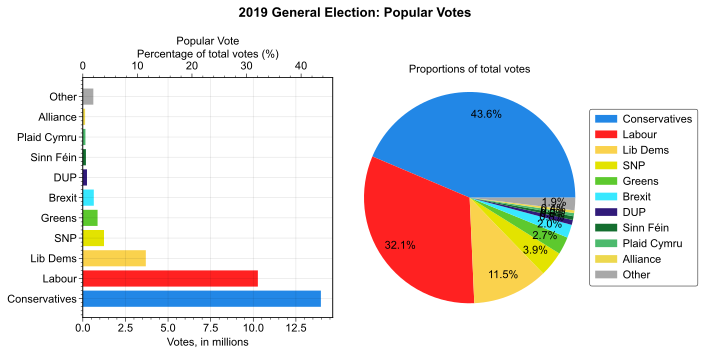
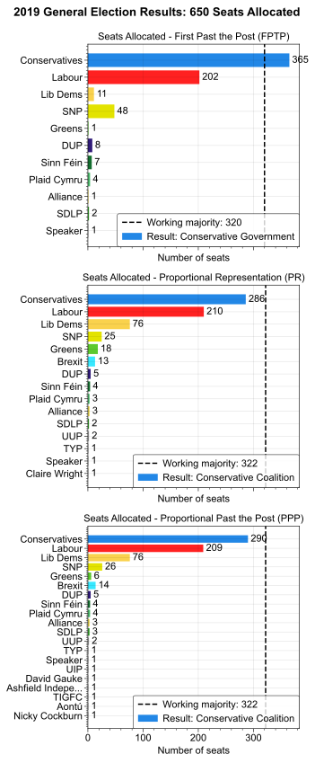
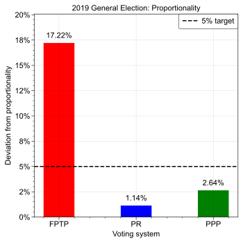

Simulation of the 2019 UK General Election using three voting systems: First Past the Post (FPTP, current), Proportional Representation (PR) and a new method known as Proportional Past the Post (PPP).

YouTube channel all about Proportional Past the Post:
[Proportional Past the Post](https://www.youtube.com/@ProportionalPastthePost)

## Election Data

Data for the 2019 UK General Election was obtained from the [House of Commons Library](https://commonslibrary.parliament.uk/research-briefings/cbp-8749/), using the 'General election results by candidate' file.

The votes for each party were as follows:

## Voting Systems

Using the above data, the results of the 2019 UK General Election were simulated using three voting systems. 'First Past the Post' (FPTP) is the method used today in the UK, in which the leading candidate in each constituency is allocated a seat. A competitor to FPTP is 'Proportional Representation' (PR), which allocates seats based on the proportion of votes each party received. This has the disadvantage of not taking into account the constituency data and often leads to hung parliaments, but is fundamentally highly democratic. A new method has been developed known as 'Proportional Past the Post' (PPP), which is a hybrid of FPTP and PR.

The results under each system are as follows:

It is observed that the proportional systems lead to a greater diversity of parties in Parliament. The 'deviations from proportionality' are shown below:

