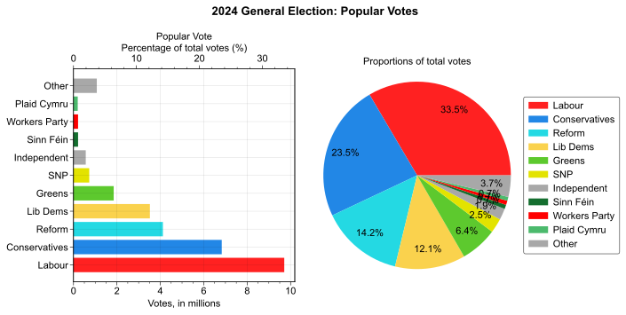
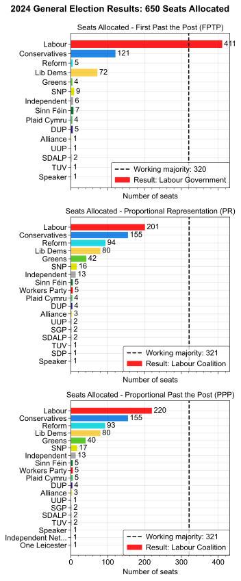
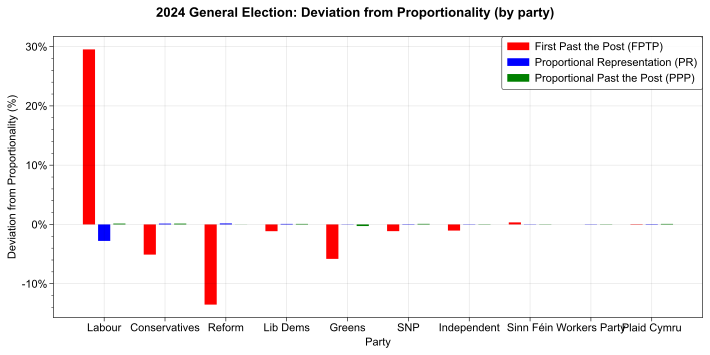

Simulation of the 2024 UK General Election using three voting systems: First Past the Post (FPTP, current), Proportional Representation (PR) and a new method known as Proportional Past the Post (PPP).

YouTube channel all about Proportional Past the Post:
[Proportional Past the Post](https://www.youtube.com/@ProportionalPastthePost)

Analysis available in file `election_2024.ipynb`.

## Election Data

Data for the 2024 UK General Election was obtained from the [House of Commons Library](https://commonslibrary.parliament.uk/research-briefings/cbp-10009/), using the 'General election results by candidate' file.

The votes for each party were as follows:

The analysis was also performed with the 2019 results. The figures are visible in the `figures` folder.

## Methodology Notes

- All "independent" candidates are lumped into a party called "Independent", and the algorithm is run as if this is a single party. The choice of whether or not to do this is important and the results change depending on it. I am not sure if this is how it is done in reality.
- At the end of the algorithm, the votes and seats for "Labour and Cooperative party" and "Labour party" are added and reported under "Labour party".

## Voting Systems

Using the above data, the results of the 2024 UK General Election were simulated using three voting systems. 'First Past the Post' (FPTP) is the method used today in the UK, in which the leading candidate in each constituency is allocated a seat. A competitor to FPTP is 'Proportional Representation' (PR), which allocates seats based on the proportion of votes each party received. This has the disadvantage of not taking into account the constituency data and often leads to hung parliaments, but is fundamentally highly democratic. A new method has been developed known as 'Proportional Past the Post' (PPP), which is a hybrid of FPTP and PR.

The results under each system are as follows:

It is observed that the proportional systems lead to a greater diversity of parties in Parliament. The 'deviations from proportionality' are shown below:

The breakdowns by each party are shown. Positive deviations represent over-representation, while negative deviations represent under-representation:

The PPP system retains the benefits of good proportionality like PR, while also maintaining the constituency link of FPTP.
